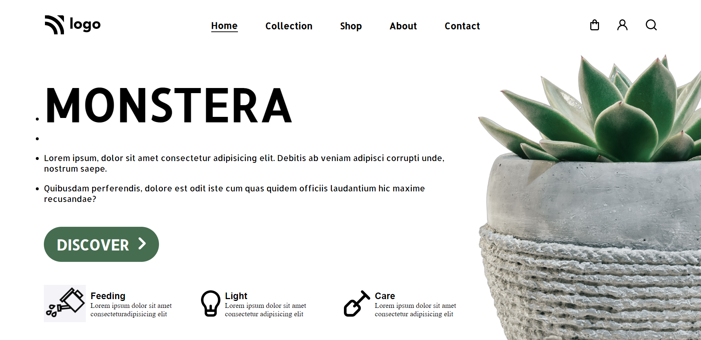

# Project_06 - HTML  and CSS 

---

## Project 06 [Live Link](https://project-06-themohitgupta.netlify.app)

---
## What I learned from this Project?

- Learned about how to design **cards**.
- Learned about use of **icons** and **buttons**.
- Learned about declareing **Internal Stylesheets**.

---

### This Project took me around **4 hours** to complete.

---

---
